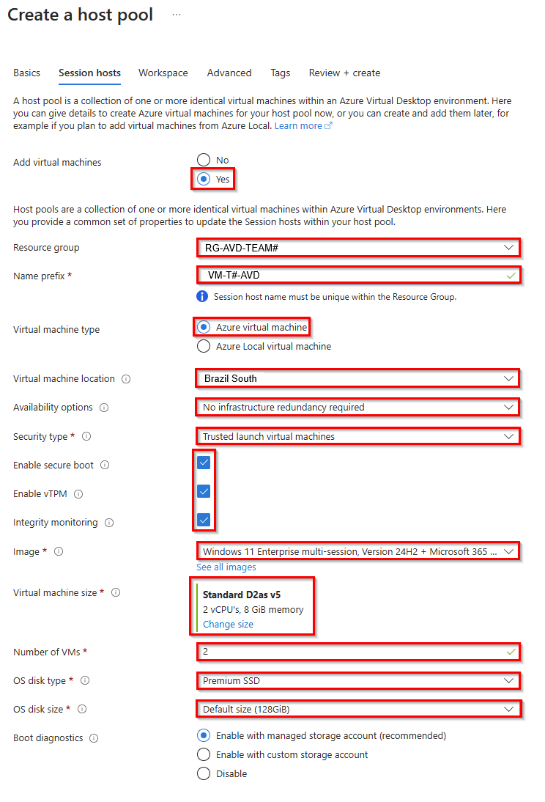
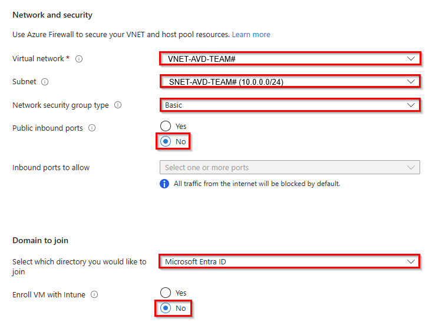
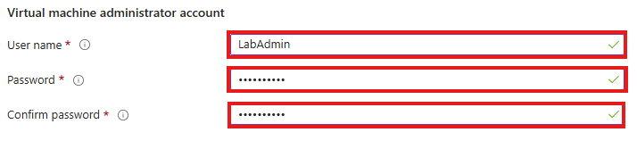
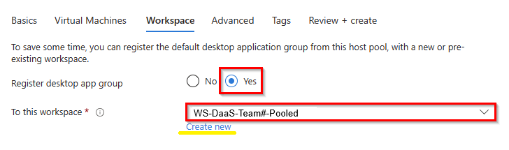
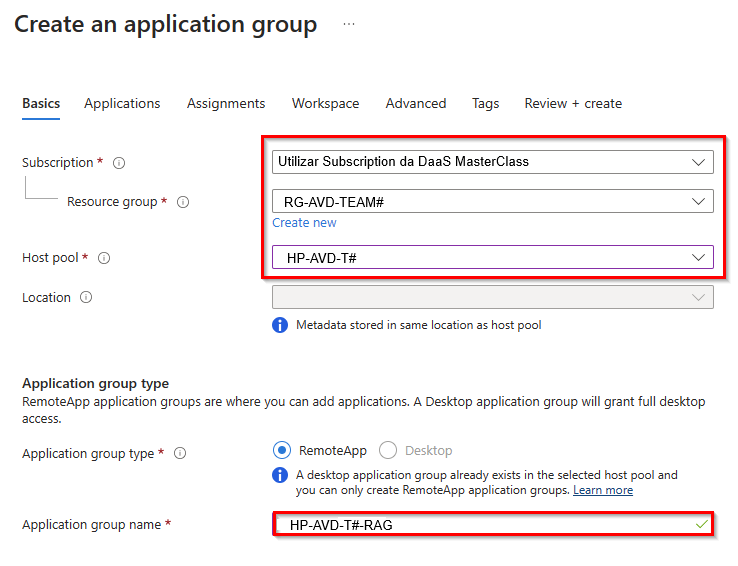
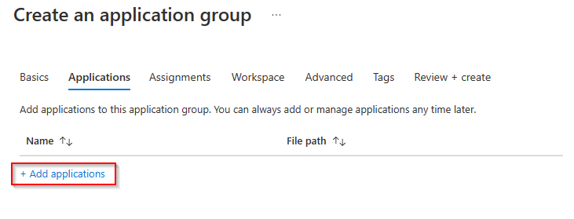
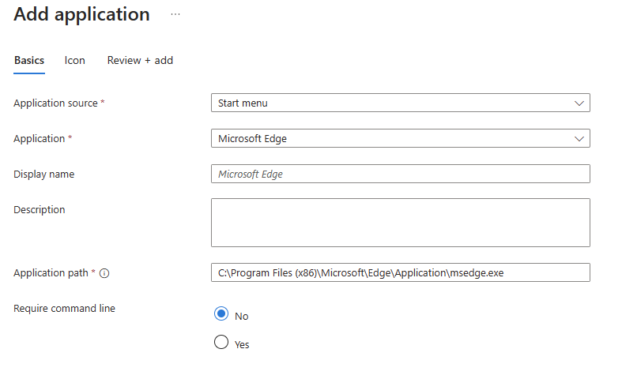
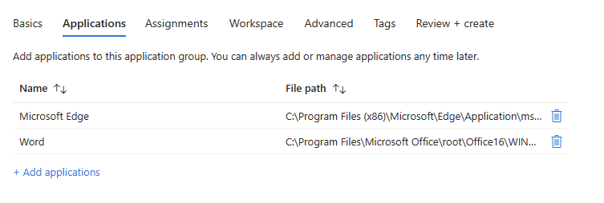

# Guia de solução 1: Criar um Host Pool para Multi-Session

Neste desafio, você criará pooled desktops ingressadas no Azure AD a partir de uma Imagem Multi-Session do Microsoft Windows 11. Após a implantação, você se conectará a esse host de sessão com o cliente de Área de Trabalho Remota nativo ou Web. 

## Desafio

Crie um hostpool Multi-Session do AVD ingressado no Microsoft Entra ID:
- Região: **Brasil South**
- Localização dos metadados: **EAST US**
- Ambiente de validação: **Não**
- Criar Session Host Configuration: **Não**
- Tipo de host pool: **Pooled**
- Família de computação: **Standard D2as v5**
- Escolha a Imagem da Galeria **Windows 11 Enterprise multi-session Version + Microsoft 365 Apps** 
- Domínio a ser ingressado: **Microsoft Entra ID (Enroll with Intune "No")**
- Registre desktop app group no **new workspace**
- Atribuir usuários
- Habilitar Microsoft Entra ID single sign on: **"Connections will use Microsoft Entra authentication to provide single sign-on."**.

Faça login no session host
- Faça login como usuário e verifique se o sistema operacional é uma sessão multi-session

Criar novos Remote Apps
- Implante o Microsoft Edge e o Word (ou qualquer outro) como aplicativos remotos

## Critério de Sucesso
1. Os Host Pools são criados e os Session Hosts são exibidos como disponíveis
2. Os usuários são atribuídos ao grupo de aplicativos apropriado do Host Pool
3. Capaz de mostrar as configurações do Host Pool definidas
4. As VMs são ingressadas no Microsoft Entra ID
5. Os usuários podem entrar na VM
6. Os aplicativos do Office podem ser acessados via RemoteApp

## 💡 Dicas 💡 
> **1.** Estamos implantando um Host Pool somente EntraID. Nesse caso, você precisa definir direitos do IAM (RBAC) no nível do  resource group. [Mais informações aqui](https://learn.microsoft.com/en-us/azure/virtual-desktop/azure-ad-joined-session-hosts#assign-user-access-to-host-pools)

> **2.** Se você estiver tentando acessar sua área de trabalho virtual de **Dispositivos Windows ou outros dispositivos que não estão conectados no mesmo Entra ID tenant**, adicione **targetisaadjoined:i:1** como uma propriedade RDP personalizada ao Host Pool. [Mais informações aqui](https://learn.microsoft.com/en-us/azure/virtual-desktop/deploy-azure-ad-joined-vm#access-azure-ad-joined-vms)

## Etapa 1 - Criar um novoPooled Host Pool e Workspace

1. Entre no [Portal do Azure](https://portal.azure.com/).

2. Pesquise **Azure Virtual Desktop** e selecione-a na lista.

3. Em Gerenciar, selecione **Host Pools** e selecione **+ Create**.
   

4. Na página Basics, consulte a captura de tela a seguir para preencher os campos obrigatórios. Selecione sua Assinatura, Resource Group e defina um nome de Hostpool. Como Localização, escolha **East US**. 

> **Info:** Isso afetará apenas os metadados. O local do datacenter para máquinas virtuais será exibido. 

Altere **Validation environment** para **No**.
Depois de concluído, selecione **Next: Virtual Machines**.

5. Navegue até **Virtual Machines** na parte superior e selecione **Yes** para adicionar novas máquinas virtuais ao Host Pools do AVD.

Selecione seu **Resource group** e insira um **VM name prefix**, ele acrescentará automaticamente "-[número]" ao nome da VM. Siga os valores mostrados na imagem abaixo:

Na última etapa, insira suas credenciais de administrador local, ignore a configuração de URL personalizada e clique em **Next: Workspace**.

 
7. Na página Espaço de trabalho, selecione **Yes** para registrar um novo grupo de aplicativos da área de trabalho. Selecione **Create new** e forneça um **Workspace name**. Selecione **OK** e **Review + create**.

8. Na página Criar um Host Pool, selecione **Create**.

> **Observação**: se você estiver tentando acessar sua área de trabalho virtual de dispositivos Windows ou outros dispositivos que não estão conectados ao Azure AD, adicione **targetisaadjoined:i:1** como uma propriedade RDP personalizada ao Host Pool. [Mais informações aqui](https://learn.microsoft.com/en-us/azure/virtual-desktop/deploy-azure-ad-joined-vm#access-azure-ad-joined-vms)

## Etapa 2 – Atribuir acesso de usuário ao Host Pool

Depois de criar seu Host Pool, você deve atribuir aos usuários acesso ao grupo de aplicativos da área de trabalho. Recomendamos que você use grupos de usuários em vez de usuários individuais sempre que possível. Como você já atribuiu as permissões de Logon de Usuário de Máquina Virtual ou Logon de Administrador de Máquina Virtual no Desafio 1 no nível do grupo de recursos, essa tarefa não é mais necessária aqui. Se você ainda não fez isso ou se usa outro Resource Group, vá em frente e atribua essas funções aos usuários que devem ser capazes de fazer login nas áreas de trabalho em pool.

1. Atribua seus usuários ou grupos ao desktop application group criado no passo 7 do exercício anterior. Ex: **HP-AVD-T1-DAG**.

2. Atribua aos usuários a  função **Virtual Machine User Login** para que eles possam entrar nas VMs.

3. **opcional** Atribua aos administradores que precisam de privilégios administrativos locais a função de logon de administrador da máquina virtual.
Para conceder aos usuários acesso a VMs ingressadas no Azure AD, você deve [configurar atribuições de função para a VM](https://docs.microsoft.com/en-us/azure/active-directory/devices/howto-vm-sign-in-azure-ad-windows#configure-role-assignments-for-the-vm). 

## Etapa 3 - Criar Remote Apps

Para disponibilizar apenas um único aplicativo para o usuário, em vez da área de trabalho completa, para que apenas o aplicativo seja renderizado no dispositivo host do qual você está trabalhando no momento, você precisa criar um grupo de aplicativos remotos. Siga as orientações:

1. Navegue até a Área de Trabalho Virtual do Azure, selecione **Application Groups** e clique em **Create**.

2. Na guia Basic, selecione seu **Resource Group**, seu AVD **Host Pools** e insira um **application group name**.

Clique em **Next: Applications**

2. Em seguida, selecione o aplicativo que deseja adicionar ao seu application group e clique em **Add applications**.

Em seguida, selecione **Start menu** como a origem do aplicativo e **Microsoft Edge** (por exemplo) como o aplicativo .

Clique em **Review + add**, depois em **Add** e adicione outro aplicativo no menu Iniciar como a origem do aplicativo.

Clique em **Next: Assignments**.

3. Atribua o grupo Usuários do AVD ao Application group que deve ter acesso aos RemoteApps.

Clique em **Next: Workspace**

4. Alterne **Register Application Group** para **Yes** e clique em **Review + create**.

> Se outro application group no Host Pool do AVD já tiver sido registrado, esse grupo de aplicativos também será registrado no mesmo workspace.

Em seguida, inicie o Remote Desktop Client App, atualize o espaço de trabalho do AVD e inicie os aplicativos remotos.

> **Observação**: se você estiver tentando acessar sua área de trabalho virtual de dispositivos Windows ou outros dispositivos que não estão conectados ao Azure AD, adicione **targetisaadjoined:i:1** como uma propriedade RDP personalizada ao Host Pool. [Mais informações aqui](https://learn.microsoft.com/en-us/azure/virtual-desktop/deploy-azure-ad-joined-vm#access-azure-ad-joined-vms)

- Desafio 2: **[Configurar Propriedades RDP](W365/02-W365-RDP-Properties.md)**

## Recursos de Aprendizagem
- [Criar Hostpool da Área de Trabalho Virtual do Azure](https://learn.microsoft.com/en-us/azure/virtual-desktop/create-host-pools-azure-marketplace)
- [Gerenciar grupos de aplicativos para o portal da Área de Trabalho Virtual do Azure](https://learn.microsoft.com/en-us/azure/virtual-desktop/manage-app-groups)
- [Conectar-se à Área de Trabalho Virtual do Azure com o cliente da Área de Trabalho Remota para Windows](https://learn.microsoft.com/en-us/azure/virtual-desktop/users/connect-windows?tabs=subscribe#install-the-windows-desktop-client)

