# Guia de solução 3: Ativar o contêiner de perfil FSLogix

## Desafio

Neste desafio, você aprenderá a:

- Instalar e configurar uma Azure Storage account para autenticação usando o Microsoft Entra Kerberos
- Atribuir permissões de acesso a uma identidade
- Criar um contêiner de perfil com o FSLogix para os hosts da sessão no Hostpool de várias sessões 

> **Nota**: Identidades híbridas são necessárias para este desafio. Os usuários e grupos devem vir de um domínio tradicional do Active Directory.

### Tarefa 1: Configurar uma Azure Storage account
- Configurar uma Azure Storage account e um Compartilhamento de Arquivos
- Habilitar o Microsoft Entra Kerberos para Azure files
    
### Tarefa 2: Atribuir permissões de acesso a uma identidade
- Os usuários do AVD precisarão de permissões de acesso para acessar o file share. Você precisa atribuir a cada usuário uma função com as permissões de acesso de usuário apropriadas

### Tarefa 3: Criar um contêiner de perfil com FSLogix
Para usar contêineres de perfil, você precisará configurar o FSLogix em suas VMs session host. 

>**Observação:** Se você estiver usando uma imagem personalizada que não tenha o FSLogix Agent já instalado, siga as instruções em [Baixar e instalar o FSLogix](https://docs.microsoft.com/en-us/fslogix/install-ht). 

>**Observação:** O agente FSLogix já está instalado nas imagens da Galeria Multissessão do Windows 10 ou 11 Enterprise fornecidas pela Microsoft.

- Habilite as configurações de perfil do FSLogix por meio de um script ou do Intune, se desejar
- Excluir perfis locais quando um perfil VHD for aplicado
- Criar um contêiner de perfil com o FSLogix durante o login do usuário

## Critério de Sucesso

- A Storage account e o compartilhamento de arquivos estão configurados corretamente
- O Microsoft Entra Kerberos está habilitado no compartilhamento de arquivos
- As permissões de acesso de usuário apropriadas são configuradas no File share
- Um contêiner de perfil com FSLogix foi criado com êxito 
- Verifique se seus perfis estão funcionando conforme o esperado

## Tarefa 1: Criar uma Storage account
Os Azure file shares são implantados em storage accounts, que são objetos de nível superior que representam um pool compartilhado de armazenamento. Esse pool de armazenamento pode ser usado para implantar vários file shares.

O Azure dá suporte a vários tipos de storage accounts para diferentes cenários de armazenamento que os clientes podem ter, mas há dois tipos principais de storage accounts para Arquivos do Azure. O tipo de Storage account que você precisa criar depende se você deseja criar um File Share padrão ou um compartilhamento de arquivos premium:

General purpose version 2 (GPv2) storage accounts: GPv2 storage accounts permitem que você implante Azure file shares em hardware standard/hard disk-based (HDD-based). Além de armazenar Azure file shares, as GPv2 storage accounts podem armazenar outros recursos de armazenamento, como blob containers, queues, or tables. Os file shares podem ser implantados em transaction optimized (default), hot, or cool tiers.

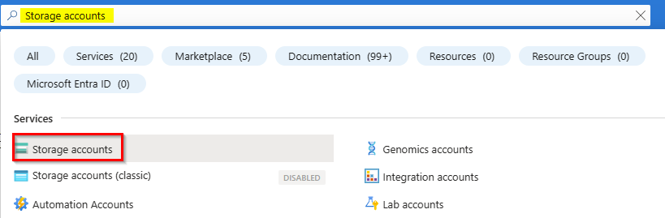

Para criar uma Storage Account por meio do portal do Azure, pesquise **Storage Accounts** e selecione o resultado da pesquisa resultante. Isso levará a uma página de visão geral para storage accounts. 

Selecione **Create** para prosseguir com o assistente de criação de Storage account.

FileStorage storage accounts: FileStorage storage accounts permitem que você implante Azure file shares em hardware premium/solid-state disk-based (SSD-based). As contas do FileStorage só podem ser usadas para armazenar Azure file shares; nenhum outro recurso de armazenamento (blob containers, queues, tables etc.) pode ser implantado em uma conta FileStorage.

Crie uma Storage account de general-purposev2 com as seguintes configurações:
- Resource group: **select your Resource group**
- Storage account name: **fslogixprofilefs (ou algo similar)**
- Region: **Brazil South**
- Performance: **Standard**
- File share billing: **Pas-as-you-go file shares**
- Redundancy: **Locally-redundant storage (LRS)**
- Click **Review** and then **Create**

> Nota: As configurações avançadas, Rede, Proteção de dados e Criptografia não precisamos alterar nada, pois escolhemos as configurações padrão

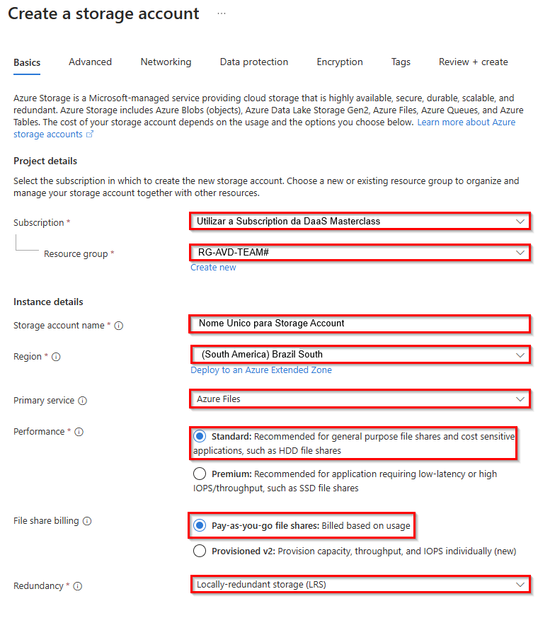

A Storage account foi criada. Agora navegue até a seção **Data storage** e selecione **File shares**.
Clique em **+ File share** na parte superior.

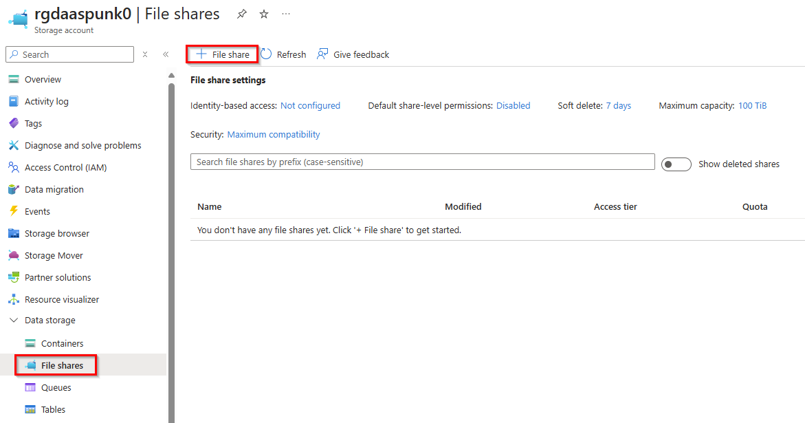

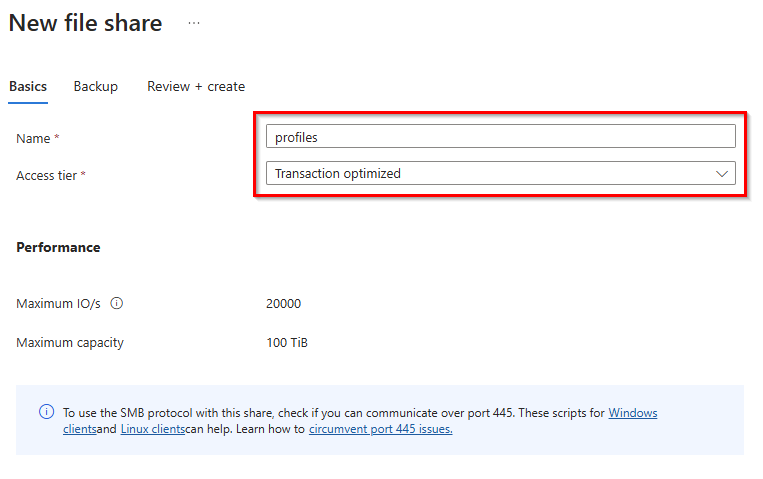

Crie um compartilhamento de arquivos com as seguintes especificações:
- Name: **profiles (ou algo similar)**
- Tier: **Transaction optimized**
- Click **create**

Clique em **Next:Backup** e desative a funcionalidade de backup do Azure.

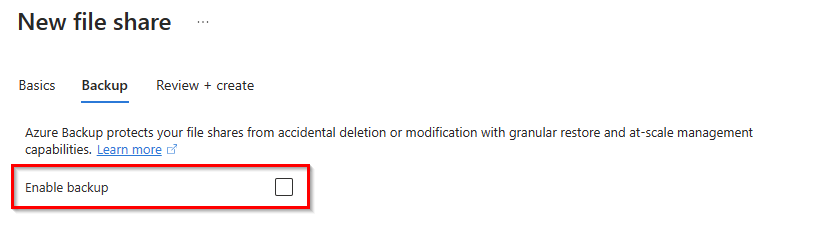

Em seguida, **Review + create** para criar o Azure file share. 

> Observação: para usar o protocolo SMB com esse compartilhamento, você precisa verificar se pode se comunicar pela porta 445. [Script para cliente Windows](https://github.com/Azure-Samples/azure-files-samples/tree/master/AzFileDiagnostics/Windows)

Quando o compartilhamento de arquivos for criado, navegue até File shares em sua Storage account. Abaixo de Configurações de compartilhamento de arquivos, clique em **Identity-based access: Not configured**.
Precisamos habilitar o acesso baseado em identidade para o compartilhamento de arquivos nesta Storage account.

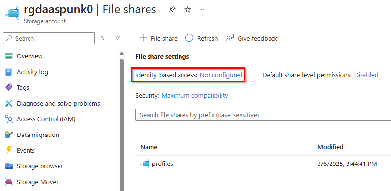

Como estamos usando o Microsoft Entra ID Kerberos nesta Master Class, clique em **Microsoft Entra Kerberos**.

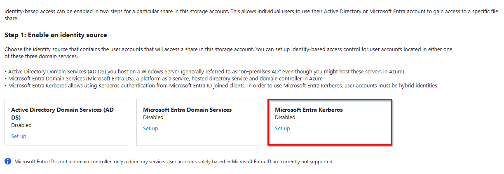

**Clique na caixa de seleção** para habilitar o Microsoft Entra Kerberos para o serviço de compartilhamento de arquivos. 
Para configurar permissões de diretório e nível de arquivo por meio do Explorador de Arquivos do Windows, você também precisa especificar o nome de domínio e o GUID de domínio para o AD local. 
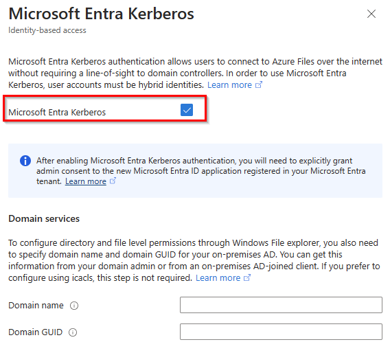

Em seguida, siga a etapa 2 para definir as autorizações no nível da versão. Você deve ativar a permissão de nível de compartilhamento padrão para todos os usuários e grupos autenticados com **Storage File Data SMB Share Contributor**.

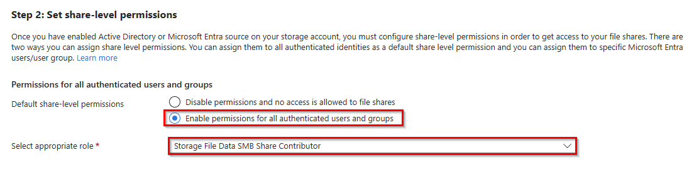

Agora vem uma etapa muito importante para a qual você precisa de pelo menos a função de **Cloud Application Administrator** para seu tenant. Você também pode pedir a um **Global Admin** em sua organização para executar essa tarefa única para concluir a configuração do Kerberos do Azure AD.

Navegue até **App Registrations** no management overview do **Microsoft Entra ID**. Alterne para **All Applications** e encontre um registro de aplicativo que comece com **[Storage account]Storageaccountname.file.core.windows.net**.

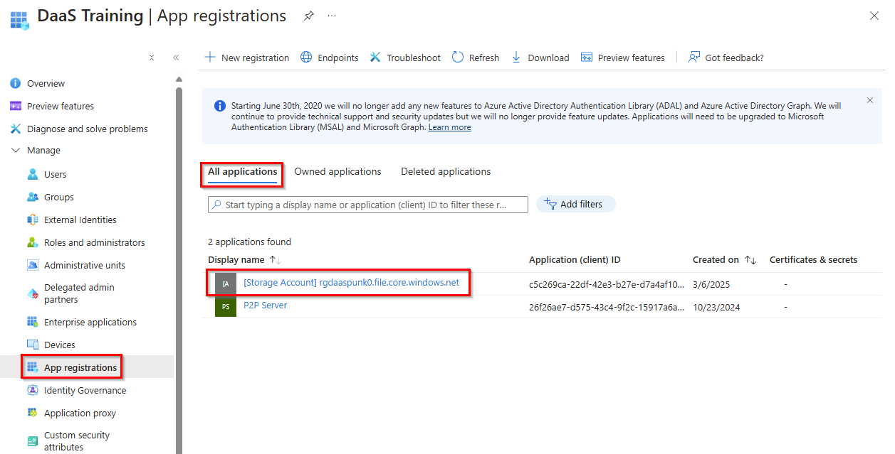

Clique em **API permissions** e depois em **Grant adminconsent for directoryname**. Verifique se a coluna de status é alterada para **Granted for directoyname**.

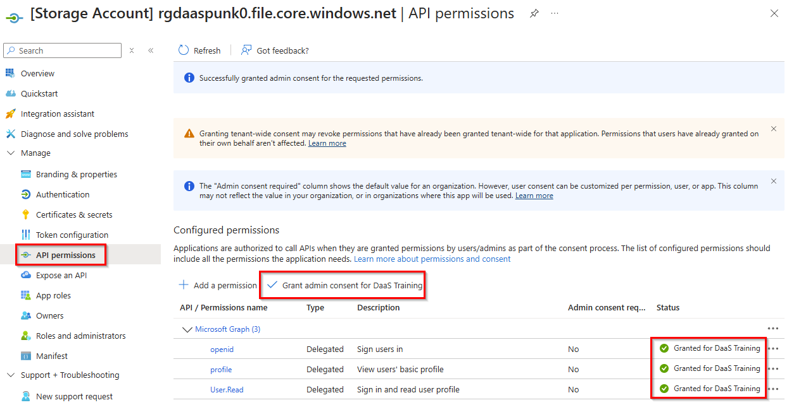

### Tarefa 2: Atribuir permissões de acesso a uma identidade

Outros usuários precisarão de permissões de acesso para acessar file share. Para fazer isso, você precisará atribuir a cada usuário uma função com as permissões de acesso apropriadas.

Para atribuir permissões de acesso aos usuários:

- No portal do Azure, **abra o file share que você criou** em Configurar uma Azure Storage account
- Selecione **Access Control (IAM)**
- Selecione **Add a role assignment**

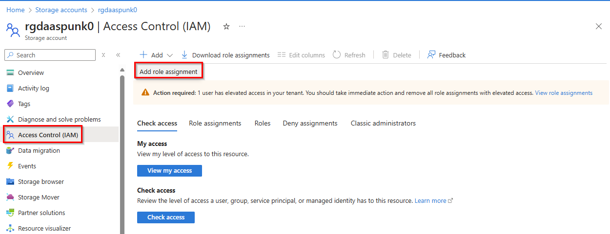

- Na guia Add role assignment, selecione a função built-in na lista de funções. 

 Você precisará pelo menos **select Storage File Data SMB Share Contributor** para que a conta obtenha as permissões adequadas.

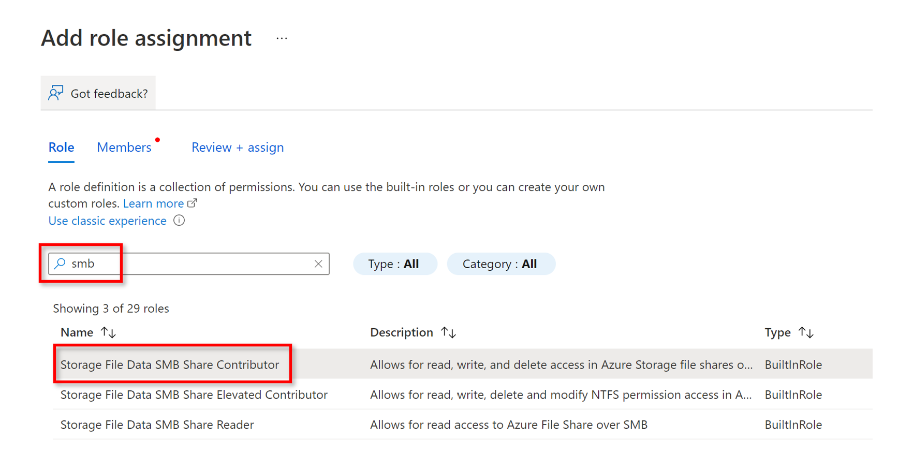

- Para Atribuir acesso a, selecione **Microsoft Entra ID user, group, or service principal**.
- **Select a name or email address for the target Microsoft Entra ID identity**.
- Selecione **Save**.

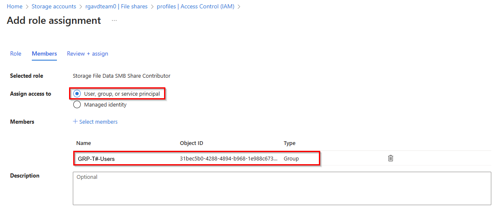

Clique em **Review + assign**

 💡> Para configurar o FSLogix nos session Hosts, você precisa carregar o setupFSLogix.ps1 em um contêiner em sua Storage account
[Configuração de extensão de script personalizado FSLogix](../Sources/setupFSLogix.ps1)

- Navegue até **Storage Account** 
- Selecione **Containers**
- Clique em **+ Container**, escolha um nome para o Container (no nosso caso, selecionamos cse para extensão de script personalizado)
- Nível de acesso público: **private**

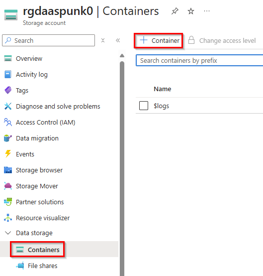

- **Selecione seu contêiner criado recentemente**
- **Carregue o setupFSLogix.ps1** conforme mostrado na captura de tela acima

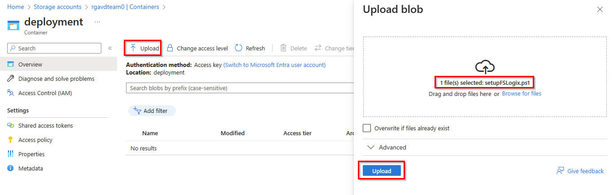

- Navegue até sua máquina virtual (do seu Hostpool de várias sessões)
- No lado esquerdo, abaixo de **Settings**, selecione **Extensions + applications**
- Clique em **Add**

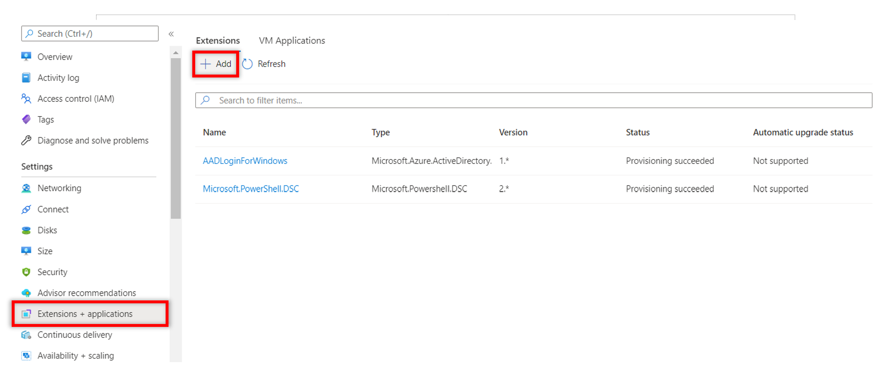

- Selecione **Custom Script Extension**

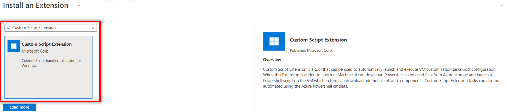

- Para o **script file** pesquise o script **setupFSLogix.ps1** em seu contêiner.
- Argumentos: digite o **Caminho UNC do seu compartilhamento de arquivos**, por exemplo, \\uniquesamicroh.file.core.windows.net\fslogixfs
- Clique em **Review + create**

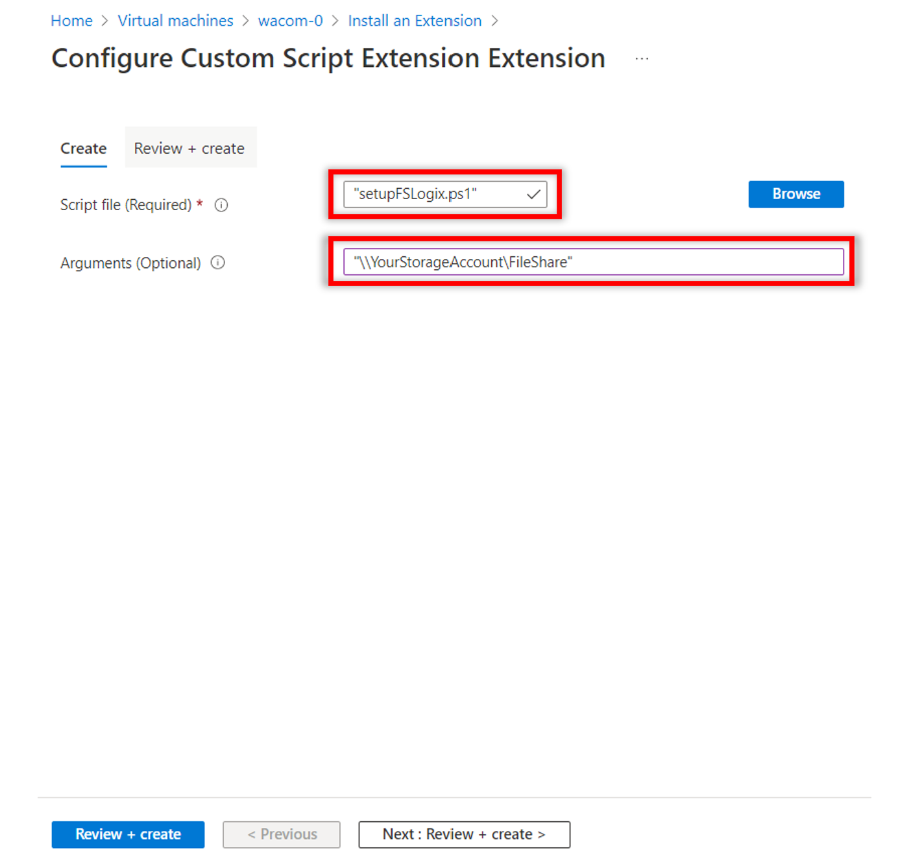

Agora, o FSLogix será configurado usando o compartilhamento de arquivos do Azure para perfis de usuário. Agora você deve ser capaz de testar com ambas as contas de usuário, se o perfil for criado corretamente em seu compartilhamento de arquivos.

### Recursos de Aprendizagem
- [Criar um contêiner de perfil com Arquivos do Azure e ID do Microsoft Entra](https://learn.microsoft.com/en-us/azure/virtual-desktop/create-profile-container-azure-ad)
- [Configurar o FSLogix para a empresa](https://learn.microsoft.com/en-us/azure/architecture/example-scenario/wvd/windows-virtual-desktop-fslogix)
- [Referência de definição de configuração](https://learn.microsoft.com/en-us/fslogix/reference-configuration-settings?tabs=profiles)
