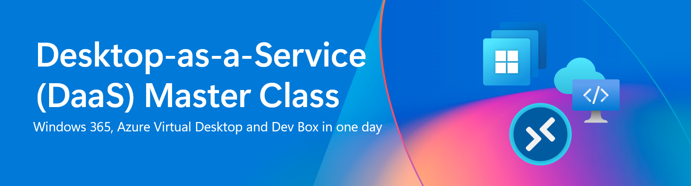

# DaaS Master Class

Esta masterclass foi projetada para ajudá-lo a obter experiência prática com o Windows 365 (W365), Azure Virtual Desktop (AVD).

W365 - é um serviço baseado em nuvem que cria automaticamente um novo tipo de máquina virtual Windows (Cloud PCs) para seus usuários finais. Cada Cloud PC é atribuído a um usuário individual e é seu dispositivo Windows dedicado. O Windows 365 oferece os benefícios de produtividade, segurança e colaboração do Microsoft 365.

AVD – é uma plataforma de desktop como serviço (desktop-as-a-service) criada diretamente na nuvem, oferecida inteiramente em nossa Nuvem Inteligente da Microsoft. Todos os serviços de infraestrutura tradicionais, como intermediação, acesso web, balanceador de carga, gerenciamento e monitoramento, fazem parte do plano de controle do AVD e podem ser configurados no portal do Azure, via Azure Resource Manager (ARM), Biceps ou Terraform.

## Objetivos de aprendizado

Descubra como selecionar a melhor opção de DaaS e domine seu cenário com Windows 365 e Azure Virtual Desktop!

Nesta Masterclass, você aprenderá como configurar e gerenciar PCs na nuvem do Windows 365 e soluções AVD com ferramentas da Microsoft.

Cobriremos tópicos como a criação de um ambiente Windows 365 e configuração do AVD, políticas de configuração de dispositivos no Intune, manipulação de propriedades RDP e lançamento de imagens personalizadas.

Você terminará esta Masterclass com o entendimento e as habilidades necessárias para dominar o mundo do DaaS e criar seu próprio cenário com Windows 365 e AVD!

## Requisitos

- Conhecimento básico do Azure [(Fundamentos do Azure)](https://learn.microsoft.com/en-us/training/paths/azure-fundamentals-describe-azure-architecture-services/)
- Conhecimento básico do Intune [(Fundamentos do Microsoft Intune)](https://learn.microsoft.com/en-us/training/paths/endpoint-manager-fundamentals/)

## Regras

1. Não abuse do poder de Direitos de Administrador para sabotar ou manipular outros participantes e seus recursos.  
2. Você receberá suas credenciais de Administrador e Usuário pessoalmente, cuide bem delas.  
3. Nomeie todos os seus recursos com **PUNK[count]**, por exemplo, PUNK1.  

## O ambiente

Esta é a arquitetura da Masterclass de W365, AVD e DevBox:

## Credenciais

Você receberá suas credenciais de Administrador e Usuário pessoalmente, cuide bem delas.

## Acessar Soluções de Nuvem do Windows

- [Cliente Web](https://windows.cloud.microsoft/)  
- [Aplicativo do Windows (loja)](https://apps.microsoft.com/detail/9N1F85V9T8BN) ou [Aplicativo do Windows (instalador offline)](https://go.microsoft.com/fwlink/?linkid=2262633)  

## Desafios

### Azure Virtual Desktop

- Desafio 1: **[Criar um pool de hosts para desktops de múltiplas sessões](<AVD/Solutionguide 1-Create a host pool for multi-session PT-BR.md>)**
- Desafio 2: **[Configurar Propriedades RDP](<AVD/Solutionguide 2-AVD-RDP-Properties - PT-BR.md>)**
- Desafio 3: **[Habilitar FSLogix Profile Container](<AVD/Solutionguide 3-AVD-FSLogix - PT-BR.md>)**  

### Windows 365

- Desafio 1: **[Provisionar um Cloud PC](W365/01-W365-Provisioning-CPC.md)**
- Desafio 2: **[Configurar Propriedades RDP](W365/02-W365-RDP-Properties.md)**
- Desafio 3: **[Implantar aplicativos via Intune](W365/03-W365-App-Deployment.md)**

## Contribuidores

- [Ben Martin Baur](https://www.linkedin.com/in/ben-martin-baur/)  
- [Daniel Weppeler](https://www.linkedin.com/in/daniel-weppeler/)  

Desenvolvido por [avdpunks.com](https://avdpunks.com)