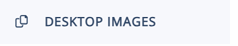
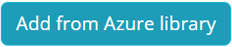
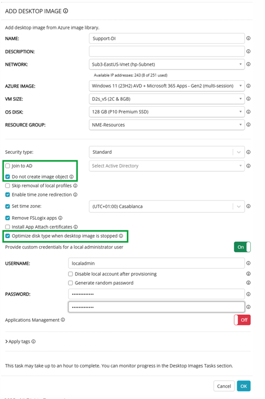

# Nerdio - Enterprise Foundations Lab Guide

### Laboratório 1 - Criando uma máquina virtual de origem de imagem

1. Faça login no sandbox. Veja seu e-mail para o link de acesso. (MUDAR)
2. Clique na guia **Desktop Images**   

3. Clique em **Add from Azure Library**     

4. Configure conforme tabela abaixo:

 | Propriedade | Valor |
 |---|---|
 | Name | **Enter a unique name. Save the name to use later!** |
 | Description | Deixe em branco |
 | Network | Deixe como padrão. |
 | Azure Image | **Windows 11 (23H2) AVD + Microsoft 365 Apps - Gen2 (multi-session)** |
 | VM Size | **D2s_v5** |
 | OS Disk | **P10** |
 | Resource Group | Deixe como padrão. |
 | Security Type | Deixe como padrão. |
 | Join to AD | **Desmarque esta opção.** |
 | Do not create image | **Marque esta opção.** |
 | Set Time Zone | **Defina para o fuso horário local.** |
 | Optimize Disk Type when Desktop Image is Stopped | **Marque esta opção.** |
 | Provide custom credentials for local admin | **Ative e insira as credenciais de administrador local para a VM de origem da imagem.** |

---

### Laboratório 3.1 - Criando um workspace AVD

1. Clique na guia **Workspaces**  
2. Clique em Novo Workspace.  
3. Configure conforme abaixo:

| Propriedade | Valor |
|---|---|
| Name(internal only) | **Insira um nome exclusivo. Salve o nome para usar depois!** |
| Friendly Name (visible to users) | **Insira um nome exclusivo.** |
| Description | Deixe em branco. |
| Resource Group | Deixe como padrão. |
| Location | **Selecione uma região próxima de você.** |

---

### Laboratório 3.2 - Criando um host pool dinâmico

1. Encontre seu Workspace.
2. Clique na seta do menu dropdown ao lado de **Workspace** e selecione **Dynamic Host Pools**.
3. Clique em **New host pool**
4. Configure conforme abaixo:

| Propriedade | Valor |
|---|---|
| HP Name(internal only) | **Insira um nome exclusivo. Salve o nome para usar depois!** |
| Description | Deixe em branco. |
| Resource Group | Deixe como padrão. |
| Desktop Experience | **Multi user desktop (pooled)** |
| Directory | Deixe como padrão. |
| FSLogix | Deixe como padrão. |
| RDP Profile | Deixe como padrão. |
| Name | **Insira um nome.** |
| Network | Deixe como padrão. |
| Desktop Image | **Windows 11 (23H2) AVD + Microsoft 365 Apps - Gen2 (multi-session)** |
| VM Size | **D2s_v5** |
| OS Disk | Deixe como padrão (E10) |
| Resource Group | Deixe como padrão. |
| Quick-Assign | Deixe em branco. |

**Note:**  
- **DO NOT ENABLE AUTO-SCALE.**  
- Monitor progress in the **Host Pools Tasks** section.  

---

### Laboratório 3.3 - Criando session hosts

1. Encontre o host pool que você criou.
2. Clique no **Nome do seu Host Pool**
3. Clique em **New Host**
4. Configure conforme abaixo:

| Propriedade | Valor |
|---|---|
| Host Count | **2** |
| Host Name | **Insira um nome.** |
| Network | Deixe como padrão. |
| Desktop Image | Deixe como padrão. |
| VM Size | Deixe como padrão. |
| OS Disk | Deixe como padrão. |
| Resource Group | Deixe como padrão. |
| Process Hosts in Groups of | **2** |
| Number of failures before Abort | **5** |

**Note:**  
- If Autoscaling is enabled, the newly added host may be deleted or stopped.  
 
---
 
© Copyright Nerdio 2025. All Rights Reserved.