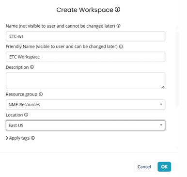
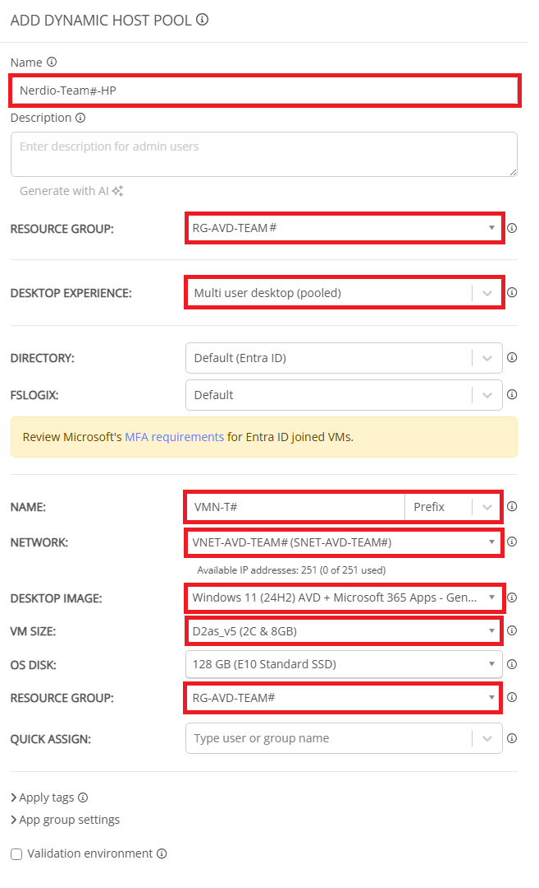
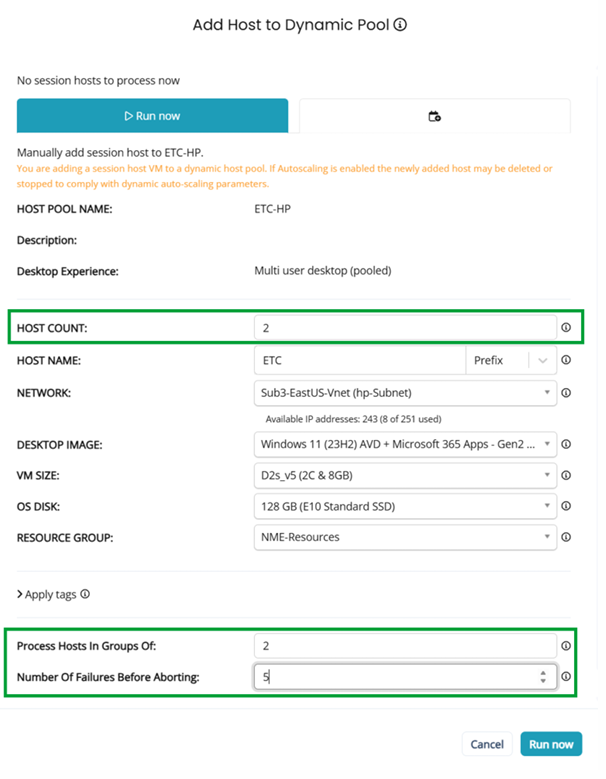

# Nerdio - Enterprise Foundations Lab Guide

### Laboratório 1 - Criando um workspace AVD

1. Clique na guia **Workspaces**  
2. Clique em Novo Workspace.  
3. Configure conforme abaixo:

| Propriedade | Valor |
|---|---|
| Name(internal only) | **Insira um nome. Ex: WS-Nerdio=TEAM#** |
| Friendly Name (visible to users) | **Insira um nome. Ex: Nerdio-Team#-Workspace** |
| Description | Deixe em branco. |
| Resource Group | **Escolha o Resource Group conforme seu time. Ex: RG-AVD-TEAM#** |
| Location | **Selecione East US.** |

**Nota: Lembre-se de trocar o # pelo número do seu time no desafio**

---

### Laboratório 2 - Criando um host pool dinâmico

1. Encontre seu Workspace.
2. Clique na seta do menu dropdown ao lado de **Workspace** e selecione **Dynamic Host Pools**.
3. Clique em **Add dynamic host pool**
4. Configure conforme abaixo:

| Propriedade | Valor |
|---|---|
| HP Name(internal only) | **Insira um nome. Ex:Nerdio-TEAM#-HP** |
| Description | Deixe em branco. |
| Resource Group | **Escolha o Resource Group conforme seu time. Ex: RG-AVD-TEAM#** |
| Desktop Experience | **Multi user desktop (pooled)** |
| Directory | Deixe como padrão. |
| FSLogix | **Deixe como OFF.** |
| RDP Profile | Deixe como padrão. |
| Name | **Insira o prefixo do nome para VM. EX:VMN-T#** |
| Network |**Escolha a VNET conforme seu time. Ex: VNET-AVD-TEAM#** |
| Desktop Image | **Windows 11 (24H2) AVD + Microsoft 365 Apps - Gen2 (multi-session)** |
| VM Size | **D2as_v5** |
| OS Disk | Deixe como padrão (E10) |
| Resource Group | **Escolha o Resource Group conforme seu time. Ex: RG-AVD-TEAM#** |
| Quick-Assign | Deixe em branco. |

**Nota: Lembre-se de trocar o # pelo número do seu time no desafio**

**Nota:**  
- **NÃO ATIVE O AUTO-SCALE.**  
- Monitore o progresso na seção **Host Pools Tasks**. 

---

### Laboratório 3 - Criando session hosts

1. Encontre o host pool que você criou.
2. Clique no **Nome do seu Host Pool**
3. Clique em **New Host**
4. Configure conforme abaixo:

| Propriedade | Valor |
|---|---|
| Host Count | **2** |
| Host Name | **Insira um nome.** |
| Network | Deixe como padrão. |
| Desktop Image | Deixe como padrão. |
| VM Size | Deixe como padrão. |
| OS Disk | Deixe como padrão. |
| Resource Group | Deixe como padrão. |
| Process Hosts in Groups of | **2** |
| Number of failures before Abort | **5** |

**Nota:**  
- Se o dimensionamento automático estiver ativado, o host recém-adicionado pode ser excluído ou parado.  
 
---
 
© Copyright Nerdio 2025. All Rights Reserved.