# Guia de solução 1: Provisionar um PC na nuvem

## Desafio

Você comprou uma licença do Windows 365. Neste ponto, você pode começar com o provisionamento de PCs na nuvem.

Para configurar seu sistema para provisionar PCs na nuvem sob demanda para você, você precisa:

- Um grupo de ID do Entra com **GRP-P[count]-Users**, por exemplo, GRP-P1-Users, já está criado.
- Atribua licenças ao seu usuário ou grupo.
- Seu usuário deve ter direitos de administrador local para seu PC na nuvem.
- Seu PC na nuvem está usando as redes hospedadas da Microsoft.
- Crie uma política de provisionamento.
- **Certifique-se de que seu PC na nuvem tenha um nome personalizado que não seja o padrão, por exemplo: CPC-P1-%RAND:5%"**

## Critério de Sucesso
1. Uma licença do Windows365 e do Intune é atribuída automaticamente aos seus usuários.
2. Seu usuário tem direitos de administrador local.
3. Uma política de provisionamento com **PP-P[count]-YourPolicyName** é criada.
4. Uma implantação de PC na nuvem está em execução.

## Passo 1 - Atribuição de licença

Inicie sessão no [Centro de administração do M365](https://admin.microsoft.com) com uma conta que tenha permissões suficientes para gerir licenças, por exemplo, com a função de administrador de licenças. 

Você pode encontrar mais informações sobre as funções de administrador do M365 [aqui.](https://learn.microsoft.com/en-us/microsoft-365/admin/add-users/about-admin-roles?view=o365-worldwide)

Há duas opções para atribuir licenças aos usuários. 

### [Opção 1] - Por atribuição de usuário

A primeira opção é atribuir por usuário. Para fazer isso, você precisa selecionar **Users** e, em seguida, **Active Users** para obter a lista de todos os usuários ativos. Em seguida, procure seu usuário, por exemplo, **Punk1**, e selecione **User, Punk1**. 

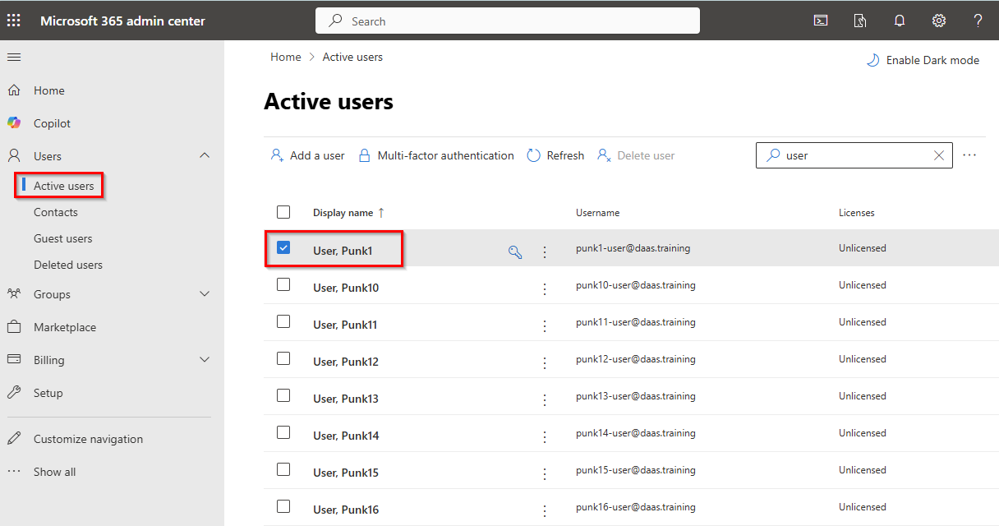

Você pode atribuir as licenças necessárias na visão geral do usuário em **Licenses and apps**. 

Selecione **Microsoft 365 E5 EEA (without Teams)** para licenciar os aplicativos do Microsoft 365 Office e o Microsoft Intune. Além disso, selecione a  licença **Windows 365 Enterprise 2 vCPU, 8 GB, 128 GB**. 

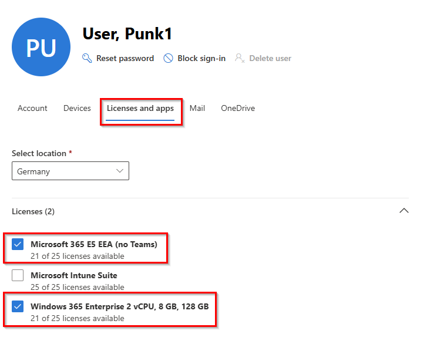

E clique em **Save changes**.

### [Opção 2] - Por Group Assignment

Outra opção é atribuir licenças por grupo. Para fazer isso, você deve selecionar **Billing** e depois **Licenses**. Em **Subscriptions** você deve encontrar todas as licenças disponíveis. Em seguida, clique em **Windows 365 Enterprise 2 vCPU, 8 GB, 128 GB**. 

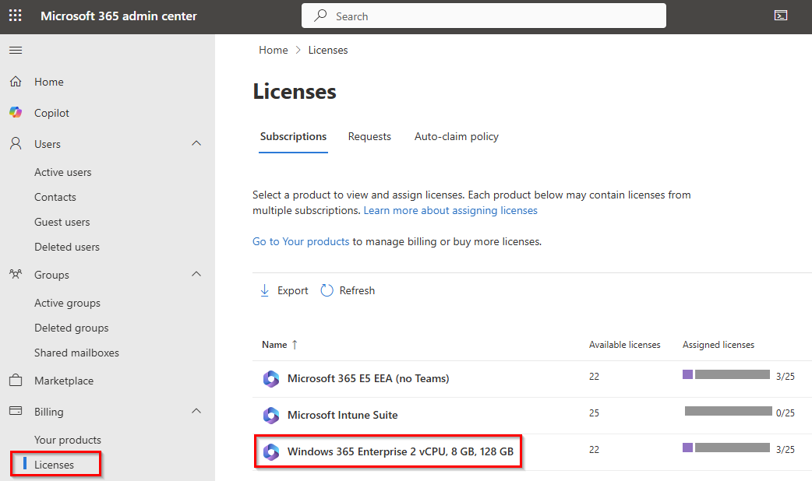

Selecione **Group** e, em seguida, **+ Assign licenses**. 

> **Nota:** Aqui também é possível selecionar usuários para atribuir uma licença a uma conta de usuário específica.    

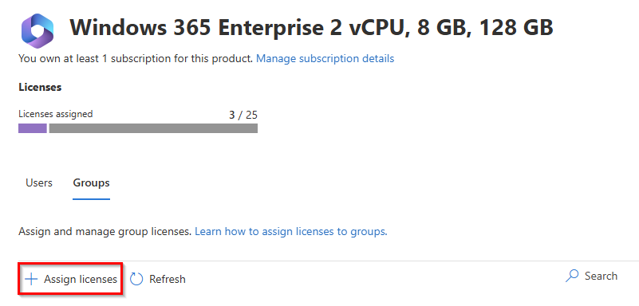

Em seguida, procure seu grupo de usuários, por exemplo, **GRP-P1-Users**, e clique em **Assign**.

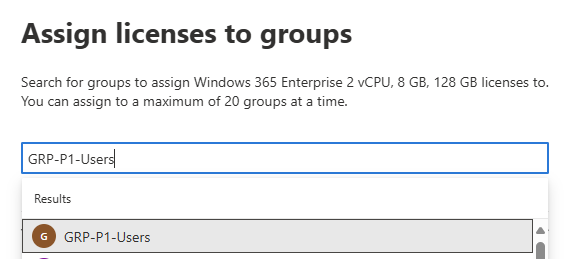

Repita a etapa anterior para atribuir as licenças do Microsoft 365 E5 ao seu grupo de usuários também.

## Etapa 2 - Definir as configurações do usuário

Com as configurações do usuário, você pode determinar se um usuário precisa obter direitos de administrador local ou não. Você também pode configurar se deseja oferecer ao usuário um serviço de restauração pontual em que os instantâneos do PC na nuvem são criados na frequência configurada. As políticas de configurações do usuário são publicadas em grupos de ID do Microsoft Entra e você pode criar diferentes políticas de configurações do usuário para diferentes grupos de usuários.

Entre no [Microsoft Intune](https://intune.microsoft.com/) e navegue até **Devices** e **Windows 365** ** para acessar o painel de gerenciamento do Windows 365. 

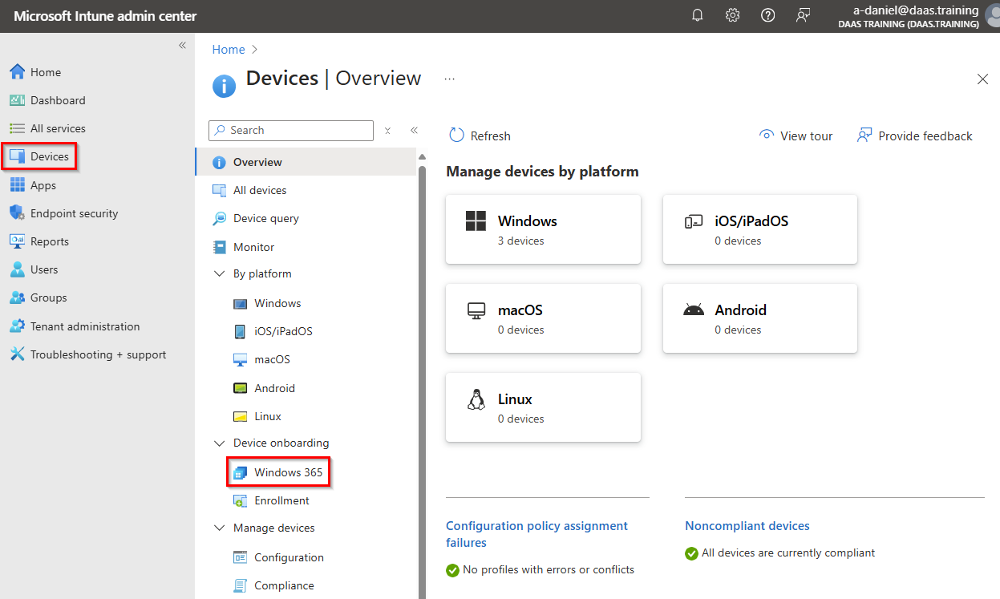

Em seguida, clique em **User settings**. 

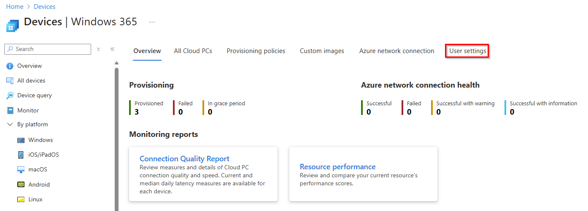

Selecione **+ Create** para criar uma nova configuração de configurações do usuário.

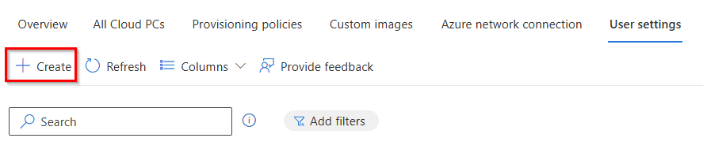

Na guia **Settings**, faça as seguintes configurações:

| Configuração | Valor | 
|--------------|-----------|
| Name | Select a name for your user setting, e.g. **UserSettings-P1**      |
| Enable Local admin     | **Enabled** |
| Enable users to reset their Cloud PCs  | **Enabled** |
| Allow user to initiate restore service    | **Enabled** |
| Frequency of restore-point service    | **12 hours** |

Em seguida, clique em **Next**.

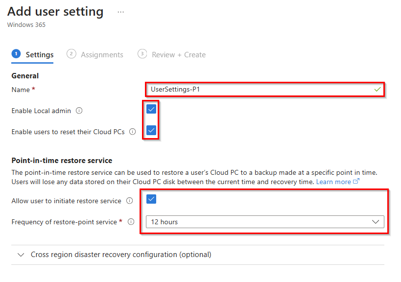

Na  guia **Assignments**, selecione a  opção **Add groups** e pesquise seu grupo de usuários, por exemplo, **GRP-P1 users** e clique em **Select**.

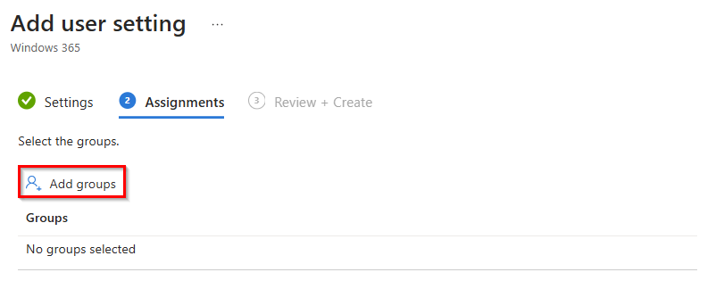

Em seguida, clique em **Next** e **Create**. 

## Etapa 3 - Criar uma política de provisionamento

Para provisionar um PC na nuvem, uma política de provisionamento precisa ser criada. Você pode criar várias políticas de provisionamento e atribuí-las a diferentes grupos do **Entra ID groups**.

No **Windows 365 management panal**, selecione **Provisioning Policy** e selecione **+ Create policy**.

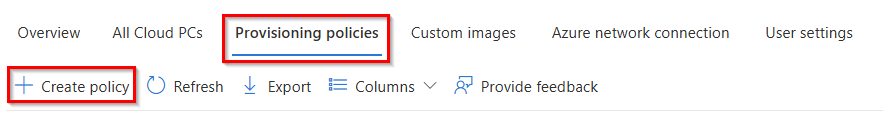

Na  guia **Settings**, faça as seguintes configurações:

| Configuração | Valor | Observação |
|--------------|-----------|-----------|
| Name | Select a name for your provisioning policy, e.g. **PP-P1-CPC-ENGLISCH**      |
| License type    | **Enterprise** |
| Join type | **Microsoft Entra Join** |
| Network    | **Microsoft hosted network** |
| Geography  | **Germany** | You can also select **European Union**. |
| Use Microsoft Entra single sign-on | **Enabled** |

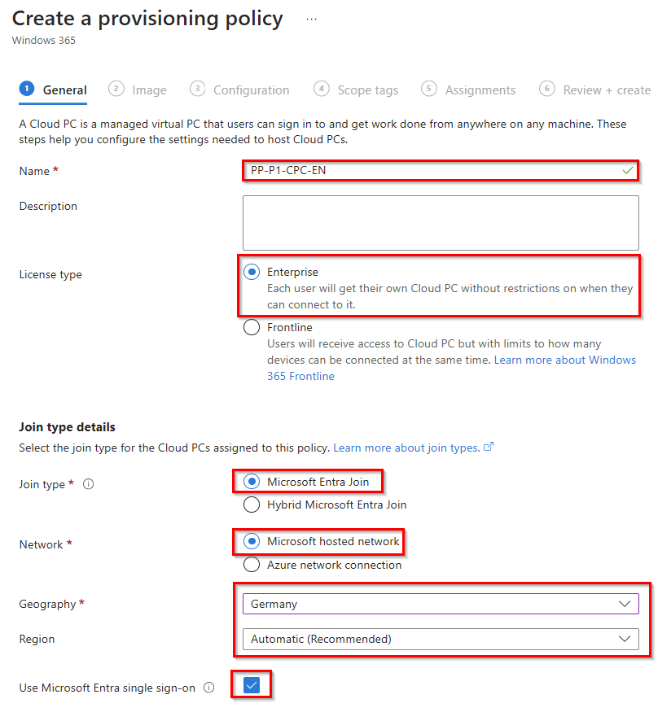

Em seguida, clique em **Next**.

Selecione uma imagem da **Gallery image**. Ao escolher a imagem da Galeria, você tem a opção de Windows 10 ou 11, com ou sem os aplicativos do Microsoft 365 e a versão/compilação.

Selecione a **latest Windows 11 Enterprise + Microsoft 365** e clique em **Next**.

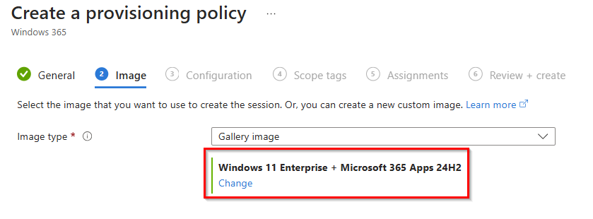

Na  guia **Configuration**, em **Language & Region**, você pode alterar o idioma padrão de seus PCs na nuvem durante o processo de provisionamento. Isso pode ser manualmente (por meio de políticas de atualização do Windows no Microsoft Intune) ou por meio do serviço Autopatch.

>**Observação**: se você selecionar um pacote de idiomas diferente do inglês, o provisionamento de PCs na nuvem levará mais tempo.

Em **Cloud PC naming** , ative a opção **Apply device name template** para que você possa usar um nome de dispositivo de PC na nuvem individual para seus usuários. Insira um **name template**, por exemplo, **CPC-P1-%RAND:5%**.

Para serviços adicionais, selecione **None** e clique em **Next**.

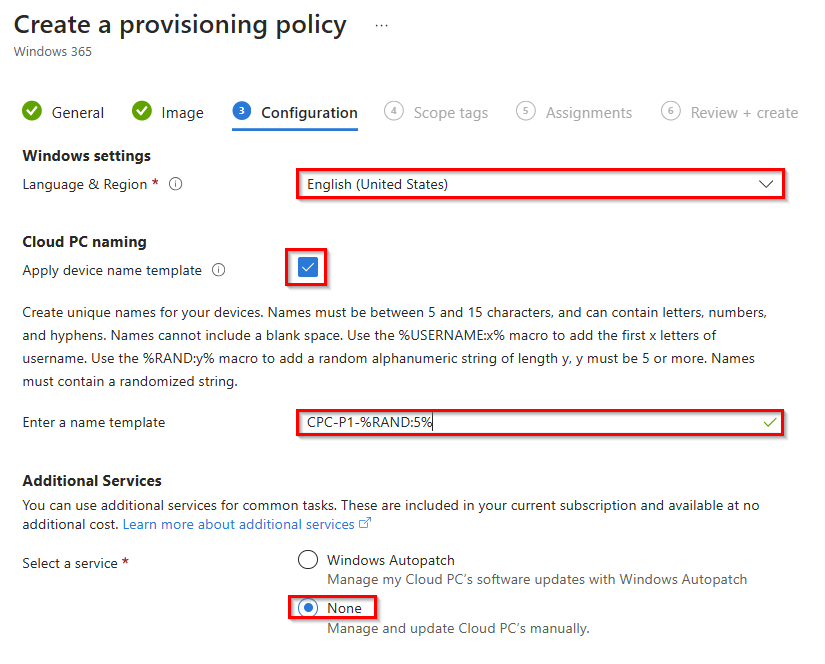

Você pode ignorar a  guia **Scope tags** e continuar com o user group **Assignments**. Clique em **Add groups** e pesquise seu grupo de usuários, por exemplo, **GRP-P1-Users** e clique em **select**. 

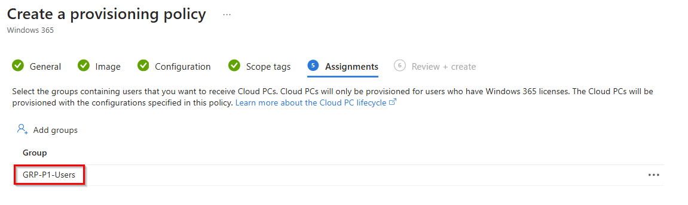

Na última etapa, clique em **Next** e **Create**. 

Em seguida, você deve ver em **All Cloud PCs** que o provisionamento do PC na nuvem foi iniciado para seu grupo de usuários. 

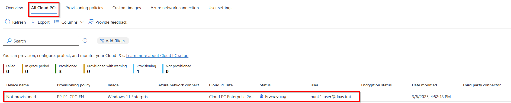

> **Observação**: o provisionamento de um PC na nuvem leva cerca de 25 a 35 minutos e depende da configuração atual da fila, região e idioma.

## Etapa 4 - Conecte-se ao seu PC na nuvem

Vamos nos conectar ao Windows 365 Cloud PC.

Abra o [**Windows App Web client**](https://windows365.microsoft.com/ent) ou use o **Windows App** e abra a **Microsoft Store** e procure por **Windows App**. Se a Microsoft Store estiver bloqueada, você poderá usar o [Windows App offline installer](https://go.microsoft.com/fwlink/?linkid=2262633) 

Faça login com seu usuário e você verá seu PC na nuvem em **Devices** e clique em **Connect** para se conectar ao seu PC na nuvem.   

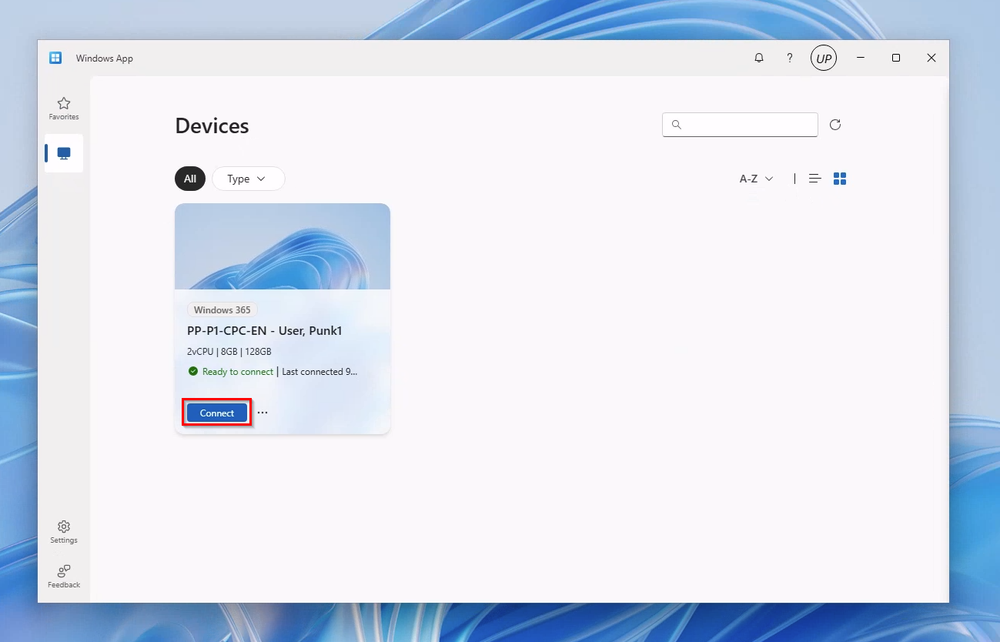

Desafio 2: **[Configurar Propriedades RDP](W365/02-W365-RDP-Properties.md)**

## Recursos de Aprendizagem
- [Deployment overview](https://learn.microsoft.com/en-us/windows-365/enterprise/deployment-overview)
- [User settings](https://learn.microsoft.com/en-us/windows-365/enterprise/assign-users-as-local-admin)
- [Create a provisioning policy](https://learn.microsoft.com/en-us/windows-365/enterprise/create-provisioning-policy)
