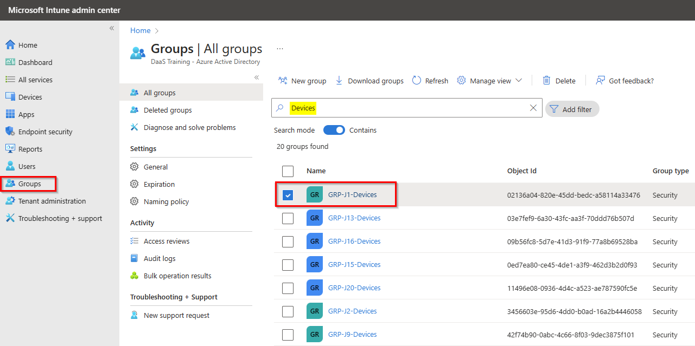
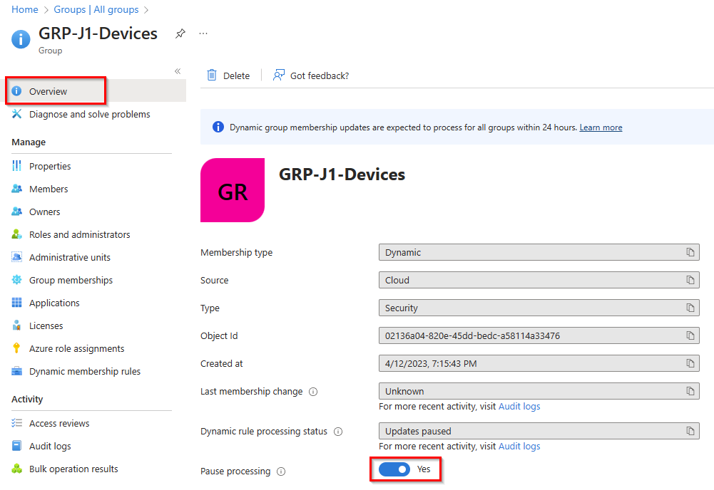
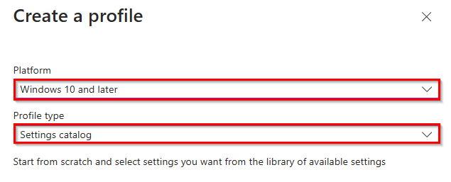
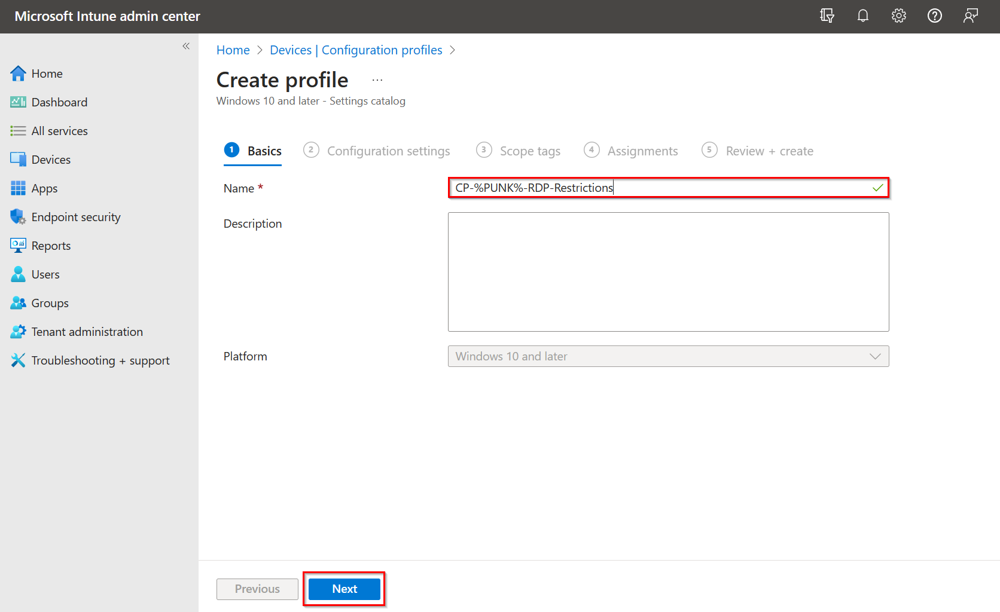
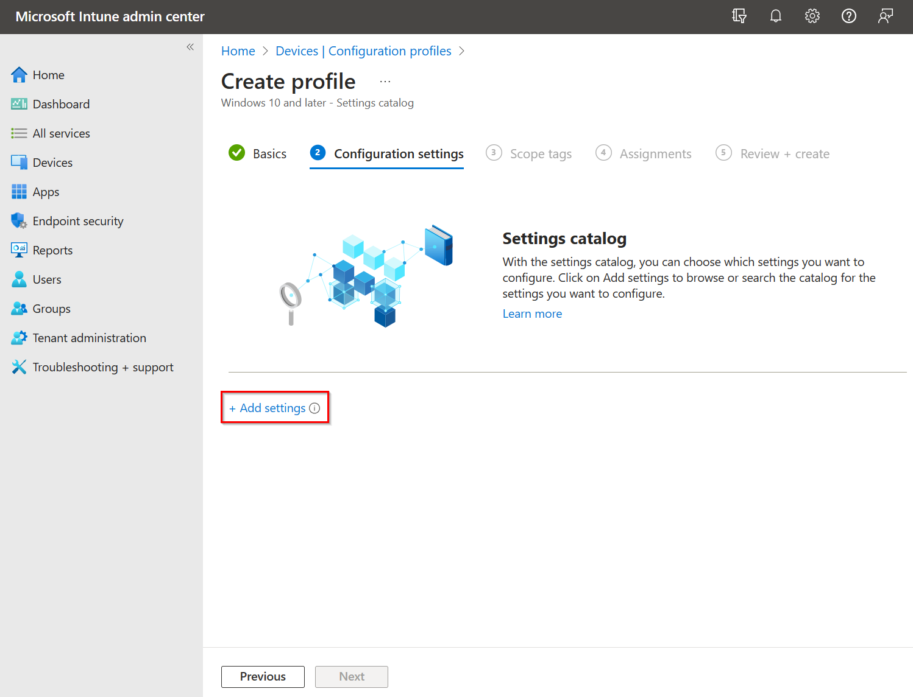
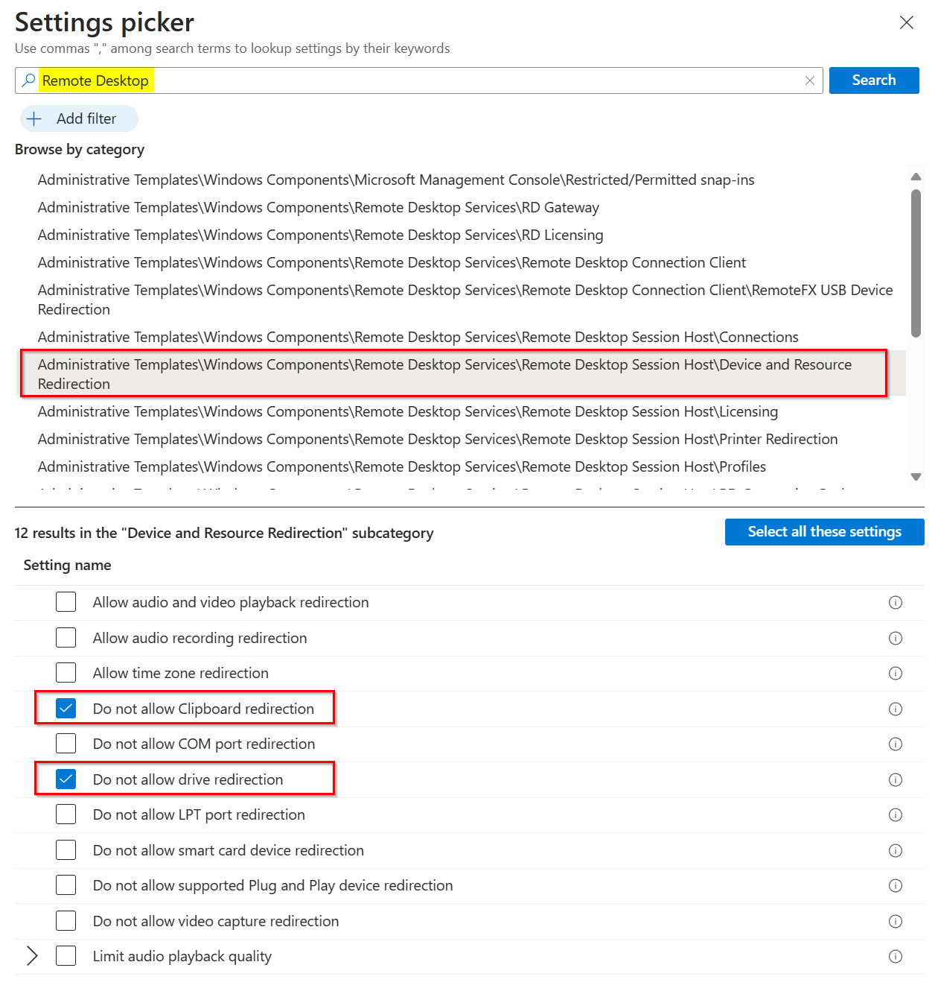
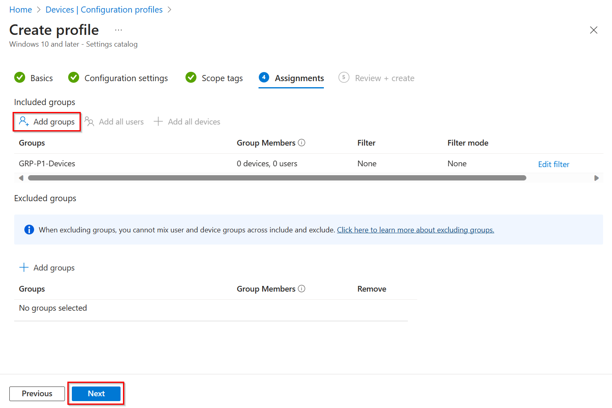

# Guia de solução 2: Configurar propriedades RDP

## Introdução

Por  motivos de **segurança**, você deseja substituir o padrão e impedir que alguns dispositivos sejam redirecionados.

## Desafio

Sua equipe de segurança deseja **evitar** que um usuário possa **copiar e colar** dados de seu cliente local para o PC na nuvem.
Além disso, nenhuma unidade local deve estar disponível na sessão remota.

## Critério de Sucesso

1. Um novo grupo dinâmico com **seu** PC na nuvem está configurado.
2. Uma nova política de configuração de dispositivo é criada para o seu PC na nuvem e **Copiar e colar** não é possível e **as unidades locais** não são redirecionadas.

### Etapa 1 - Configurar seu grupo dinâmico para seus PCs na nuvem (dispositivos)

Abra o Microsoft Intune Admin Center [https://in.cmd.ms/](https://in.cmd.ms/) e selecione **Groups** para exibir todos os grupos de ID do Microsoft Entra. 

Em seguida, procure por **Dispositivos** (o modo de pesquisa deve estar ativado) e selecione seu grupo de dispositivos de usuário.

Em seguida, selecione **Dynamic Membership Rules** e adicione uma nova regra ou modifique a regra existente para incluir todos os dispositivos com o nome de exibição que você configurou no perfil de provisionamento do W365. E então **Save**. 

Lastly, you need to check that the processing status of the dynamic rule is not "Paused", otherwise you need to change the processing pause value from **Yes to No**.
Por fim, você precisa verificar se o status de processamento da regra dinâmica não está "Paused", caso contrário, você precisa alterar o valor da pausa de processamento de **Yes para No**.

## Etapa 2 – Configurar um perfil de configuração de dispositivo Intune para as configurações de RDP

Primeiro, abra a  guia **Devices** e selecione **Configuration profiles** e, em seguida, **Create profile** para criar um novo Perfil de Configuração de Dispositivo do Intune.

Selecione **Windows 10 and later** como Plataforma e **Settings catalog** como Tipo de perfil e clique em **Create**.

Insira o nome do seu perfil de configuração **CP-%PUNK%-TEXT**, por exemplo, CP-P1-RDP-Restrictions e clique em **Next**.

Clique em **+ Add settings** para adicionar configurações ao seu perfil de configuração. 

Em seguida, procure por **Remote Desktop** e abra a categoria com **...\Device and Resource Redirection** e selecione **Do no allow Clipboard redirection** e **Do not allow drive redirection**.

Depois disso, você pode fechar o seletor de configurações.

Na Aba Configuration Settings, você deve habilitar as duas configurações de RDP e clicar em **Next**.

A guia cope Tags pode ser ignorada, mas a guia Assignment é importante. Aqui você precisa clicar em **Add Groups**  para adicionar seu grupo específico de dispositivos Cloud PC, por exemplo, dispositivos GRP-P1.

Clique em **Next** e depois em **Create**.

Desafio 3: **[Implantar aplicativos via Intune](03-W365-App-Deployment.md)**

## Learning Resources
- [Manage RDP Devices](https://learn.microsoft.com/en-us/windows-365/enterprise/manage-rdp-device-redirections)
- [Dynamic membership rules for groups in Azure Active Directory](https://learn.microsoft.com/en-us/azure/active-directory/enterprise-users/groups-dynamic-membership)
- [Create a device profile in Microsoft Intune](https://learn.microsoft.com/en-us/mem/intune/configuration/device-profile-create)