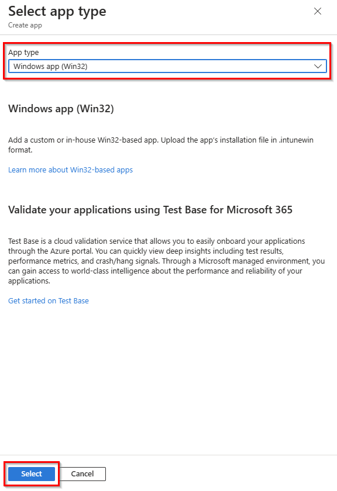
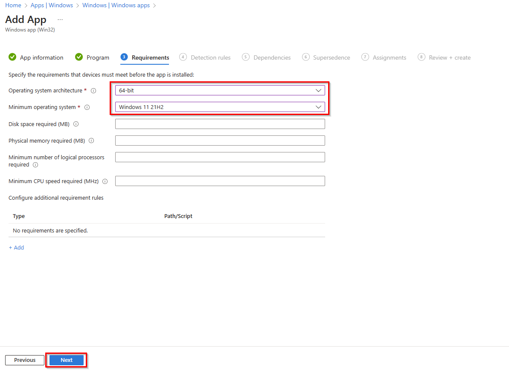
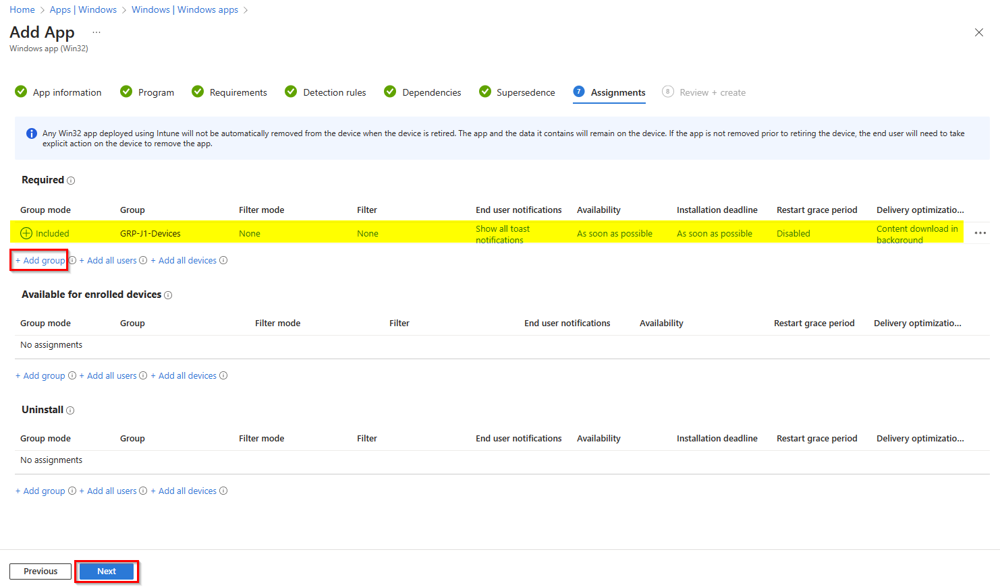

## Introdução

Como administrador de TI, uma das maneiras mais fáceis de começar a usar o Windows 365 é criar PCs na nuvem com imagens de galeria padrão do Windows 10/11 Enterprise. 

Após o provisionamento, você pode personalizar a experiência do usuário usando o Intune para enviar aplicativos por push para os PCs na nuvem dos usuários. Essas imagens podem incluir aplicativos cliente Windows existentes já em seu ambiente Intune. Como esses dispositivos de PC na nuvem estão registrados no Intune, você pode tratá-los como qualquer outro dispositivo Windows em seu ambiente.

## Desafio


É importante que seus usuários tenham o Visual Studio Code instalado.

## Critério de Sucesso


1. O Visual Studio Code, com o nome **APP-%PUNK%-YourAppName** está disponível como um novo aplicativo do Windows (Win32) no Intune.
2. O aplicativo Visual Studio Code é atribuído e instalado em seu PC na nuvem.

## Etapa 1 – Criar um novo Winodows app (Win32) por meio da implantação do Intune

1. Abra o Centro de Administração Microsoft Intune [https://in.cmd.ms/](https://in.cmd.ms/) e selecione **Apps** e **Windows** para adicionar um novo Windows App.

2. Clique em **Add** para adicionar um novo aplicativo do Windows e selecione o tipo de aplicativo **Windows app (Win32)** e confirme com **Select**.


> **Observação**: para aplicativos do Windows (Win32), você precisa converter as fontes de instalação, como exe ou msi, em um pacote intunewim. [Aqui você encontrará a ferramenta de preparação](https://github.com/Microsoft/Microsoft-Win32-Content-Prep-Tool)



3. Em seguida, escolha **your application package in format intunewim** e clique em **OK**. 

> **Observação**: Se você não quiser criar seu próprio pacote VSCode Intunewim, preparamos um pacote [aqui](Sources/VSCodeSetup-x64.intunewin)


4. Insira o **App name**, por exemplo: APP-P1-VSCodeSetup e clique em **Next**.


5. Na aba Program, você precisa definir os comandos de instalação e desinstalação do aplicativo. 


Para o VSCode, você pode usar os seguintes comandos:

```
# Install command: 
VSCodeSetup-x64.exe /VERYSILENT  /NORESTART /MERGETASKS=!runcode
# Uninstall command: 
"%ProgramFiles%\Microsoft VS Code\unins000.exe" /VERYSILENT /NORESTART
```
Selecione **System** como o comportamento de instalação e clique em **Next**.

6. Na guia Requisitos, você precisa especificar os requisitos que os dispositivos devem atender antes que o aplicativo possa ser instalado.



Selecione **64 bits** como a arquitetura do sistema operacional e, por exemplo, **Windows 11 21H2** como o sistema operacional mínimo. Em seguida, clique em **Next**.

7. Em seguida, você precisa configurar uma detection rule para verificar quando o aplicativo for instalado com sucesso.


Selecione **Manually configure detection rules** como rules format e clique em **Add**.  

8. Configure a detection rule com os seguintes valores e clique em **OK**.

| Configuração | Valor |
 |---|---|
 | Rule type | File |
 | Path | C:\Program Files\Microsoft VS Code\ |
 | File or folder | Code.exe |
 | Detection method | File or folder exists|
 


9. Em seguida, você pode pular a guia Dependencies and Substitutions e continuar com a guia Assignments.

Em Requried, clique em **+ Add group** e selecione seu grupo de dispositivos, por exemplo,GRP-P1-Devices e, em seguida, clique em **Next** para verificar todas as configurações.



10. Por fim, clique em **Create** para adicionar um novo aplicativo do Windows (Win32) ao Intune.

> **Observação**: o aplicativo será instalado o mais rápido possível ou com a próxima sincronização, mas você pode pressioná-lo um pouco para acionar uma sincronização manual ou reiniciar o Windows 365 Cloud PC.


## Recursos de Aprendizagem
- [Windows 365 and Apps](https://learn.microsoft.com/en-us/windows-365/enterprise/app-overview)
- [How to create an Intune App](https://learn.microsoft.com/en-us/mem/intune/apps/apps-win32-prepare)
- [How to assign apps to groups](https://learn.microsoft.com/en-us/mem/intune/apps/apps-deploy)
