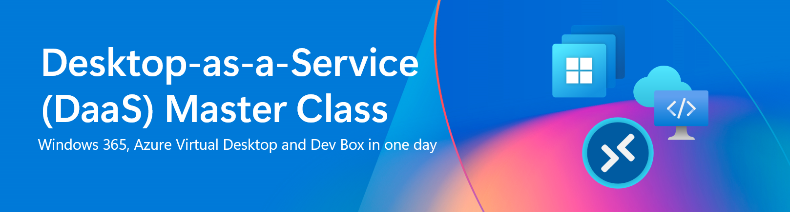

# DaaS Master Class

Esta masterclass foi projetada para ajudá-lo a obter experiência prática com o Windows 365 (W365), Azure Virtual Desktop (AVD).

W365 - é um serviço baseado em nuvem que cria automaticamente um novo tipo de máquina virtual Windows (Cloud PCs) para seus usuários finais. Cada Cloud PC é atribuído a um usuário individual e é seu dispositivo Windows dedicado. O Windows 365 oferece os benefícios de produtividade, segurança e colaboração do Microsoft 365.

AVD – é uma plataforma de desktop como serviço (desktop-as-a-service) criada diretamente na nuvem, oferecida inteiramente em nossa Nuvem Inteligente da Microsoft. Todos os serviços de infraestrutura tradicionais, como intermediação, acesso web, balanceador de carga, gerenciamento e monitoramento, fazem parte do plano de controle do AVD e podem ser configurados no portal do Azure, via Azure Resource Manager (ARM), Biceps ou Terraform.

# Contribuidores

- [Ben Martin Baur](https://www.linkedin.com/in/ben-martin-baur/)  
- [Daniel Weppeler](https://www.linkedin.com/in/daniel-weppeler/)  

Desenvolvido por [avdpunks.com](https://avdpunks.com)